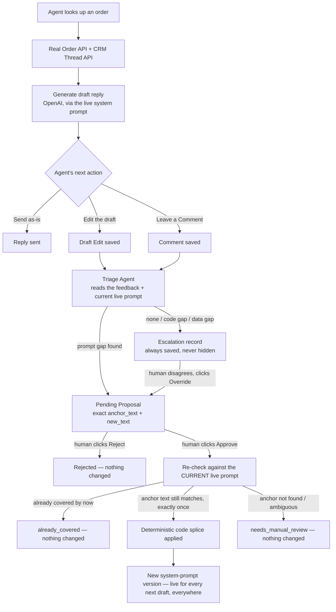
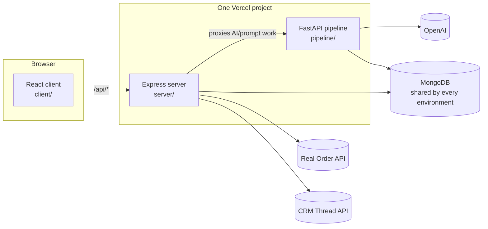
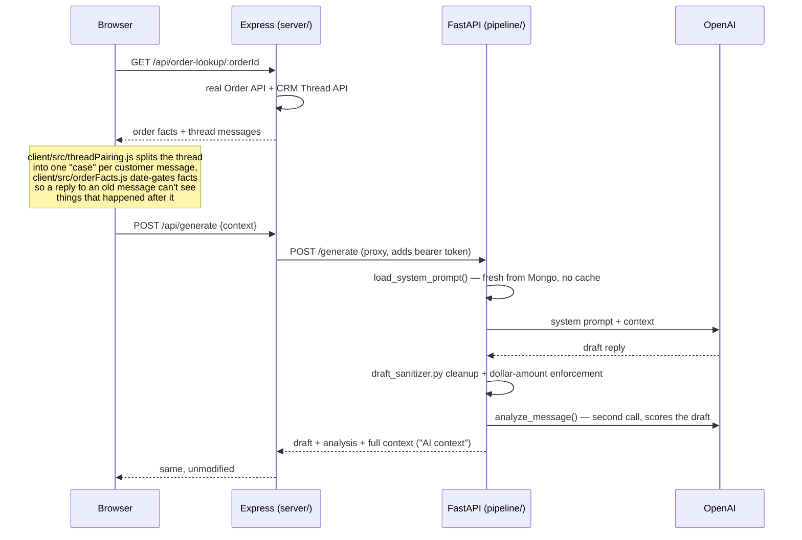
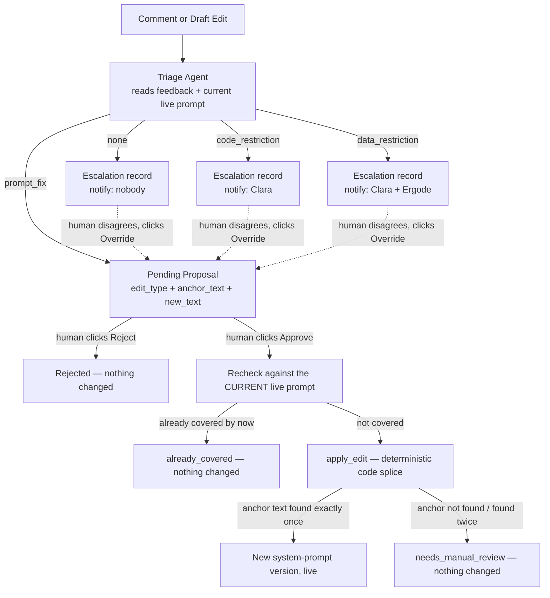

# Ergode AI Email Automation — Architecture

This document is for anyone new to the codebase. It explains what the system does,
how the pieces fit together, and *why* several things are built the way they are —
most of those reasons come from real incidents during development, not
speculation, so they're worth reading before changing that code.

## 1. What this is

A tool for Ergode's customer support team: look up an Amazon/marketplace order,
generate an AI-drafted reply to the customer using real order/shipment data, edit
it if needed, and send it. A separate feedback loop lets agents flag problems with
a draft, which an AI "triage agent" turns into either a proposed fix to the
system prompt (never applied without a human clicking Approve) or an escalation to
the team that owns the underlying issue.

## End-to-end flow

Everything in this system, start to finish — order lookup through a fix actually
going live:



## 2. The three services



- **`client/`** — React + Vite + Tailwind. Talks only to the Express server, never
  directly to the pipeline or MongoDB.
- **`server/`** — Express (Node). Owns the real Order API and CRM Thread API
  integrations, owns the `order_comments` collection directly, and **proxies**
  every AI/prompt-related call through to the pipeline (see `server/routes/*.js` —
  each one is a thin `fetch()` to the matching pipeline endpoint plus the shared
  bearer token).
- **`pipeline/`** — FastAPI (Python). The *only* thing that talks to OpenAI. Owns
  the system prompt, draft generation, and the triage/proposal/escalation logic.

They're two separate Vercel deployments in production (client is its own
project; server+pipeline deploy together — see `vercel.json`, which routes
`/pyapi/(.*)` to `pipeline/api.py` and everything else to `server/server.js`).
Locally, all three run as separate processes on different ports and the client's
Vite dev server proxies `/api` to the Express server (`client/vite.config.js`).

`vercel.json` pins the server+pipeline functions to **`bom1` (Mumbai)** —
the MongoDB Atlas cluster is in AWS `ap-south-1` (Mumbai) and the team is
in India, so every browser→function and function→DB round trip stays
in-region. Leaving the functions on the default US region was measured
adding ~3s to every page load (cold start against a cross-continent DB
connection). The client project is static/CDN-served, so its region
doesn't matter.

**Critical fact:** local dev and every deployed environment share the **exact
same MongoDB cluster**. There is no separate dev/staging database. A system
prompt edit or an approved proposal is instantly live everywhere the moment it's
saved — but a **code** change needs an actual `git push` + Vercel redeploy to
reach production. Mixing these two up (assuming a code fix is "live" because the
data changed) has caused real confusion before.

## 3. Repo layout

```
client/src/
  App.jsx                 top-level tab bar (Order Lookup / System Prompt / Pending Approvals)
  api.js                  the only file that knows the server's HTTP API shape
  pages/
    OrderLookupPage.jsx    search an order, view the thread, generate/edit/comment on drafts
    SystemPromptPage.jsx   live prompt editor + Editor/History toggle
    PendingApprovalsPage.jsx  the triage-agent review dashboard (stats, donut, table, detail panel)
    LoginPage.jsx
  components/
    AppShell.jsx           page frame: header, logo, NotificationBell, background
    NotificationBell.jsx   polls pending-proposal/escalation counts every 45s
    CommentsSidebar.jsx    read-only history of every comment, across every order
    EditableDraft.jsx      the generated draft: Edit / Comment buttons live here
    AiContextPanel.jsx     "what the AI read to write this" — reused in several places
    PromptVersionHistory.jsx  every past prompt version; expand to view/restore
    EscalationBadge.jsx    small pill: Code Restriction / Data Restriction / No gap found
    SnapshotBlock.jsx      "Customer said" / "AI replied" text block, shared

server/
  server.js                mounts every route, single shared-password auth middleware
  db.js                    lazy MongoDB connection singleton (Node side)
  routes/                  one file per resource. generate.js/translate.js/draftEdit.js
                            and proposals' approve|reject / escalations' override still
                            proxy to the pipeline (they need OpenAI). Everything else -
                            all read endpoints, plus the whole system_prompts collection
                            (systemPrompt.js) - reads/writes Mongo directly from Node, so
                            a page load never pays the Python cold start. comments.js and
                            orderLookup.js do real work.
  services/
    orderApiClient.js, crmThreadApiClient.js   the real external integrations
    disclosureClassifier.js                    decides which order fields are customer-safe
    authToken.js                               shared-password → deterministic token
    proposalStore.js, escalationStore.js, systemPromptStore.js
                                               Node-side copies of the pipeline stores'
                                               read/append logic, to skip the Python hop

pipeline/
  api.py                   all HTTP routes (FastAPI), mounted twice — see §6
  draft_generator.py       builds the prompt + calls OpenAI to write a reply
  analysis.py               scores a draft (sentiment/urgency/confidence/needs_review)
  draft_sanitizer.py        deterministic post-processing OpenAI's own output can't be trusted to do (see §7)
  system_prompt_store.py    versioned read/write for the live system prompt
  triage_agent.py           the feedback-triage classifier + fix-drafting logic
  prompt_proposal_store.py  proposal storage, approve/reject, the anchor-based safe-apply logic
  escalation_store.py       code/data-restriction (and "none") records
  db.py                     lazy MongoDB connection singleton (Python side)
  config.py                 all settings/secrets, loaded from .env
```

## 4. Generating a draft reply



The "AI context" object returned here (`{context, system_prompt_version,
thread_meta, reasoning, policy_applied, fields_used}`) is the same shape
`AiContextPanel.jsx` renders everywhere it appears — on the generate flow, in
CommentsSidebar, and in the Pending Approvals detail panel. It's captured once,
at generation time, and carried through untouched into Comments and later into
proposals/escalations, so nobody ever has to regenerate a draft to see what the
AI actually saw.

## 5. The system prompt

Stored in MongoDB's `system_prompts` collection as an **append-only log** — every
save inserts a new document `{version, content, updated_at, source,
source_proposal_id, source_comment_id}`, nothing is ever overwritten
(`system_prompt_store.py`). "Current" is just the highest `version`.
`load_system_prompt()` reads it fresh on every single generation call — no
caching anywhere — so an edit on the System Prompt page takes effect on the very
next draft generated, everywhere, instantly.

Two ways a new version gets created:
1. **Manual** — typing directly into the System Prompt page's editor and clicking
   Save. Always instant, no approval step. This is also what "Restore" on a past
   version does (`PromptVersionHistory.jsx`) — it just saves that old text as a
   brand-new latest version.
2. **Approved proposal** — see §6. Tagged with `source: "proposal"` and which
   comment/proposal it came from, so Version History can show the attribution.

## 6. The feedback & triage loop

This is the newest and largest piece of the system. Two ways a support agent
gives feedback on a draft:

- **Comment** — `EditableDraft.jsx`'s "Comment" button. Written straight to
  `order_comments` by `server/routes/comments.js` (Node owns this collection
  directly — the only collection Node writes to besides proxying).
- **Draft Edit** — `EditableDraft.jsx`'s "Edit" button, rewriting the draft
  in place. Saved via `pipeline/api.py`'s `PUT /draft-edit`.

**Both automatically trigger the triage agent** — no button, no delay beyond the
OpenAI call itself (`server/routes/comments.js` awaits `pipeline/api.py`'s
`POST /triage`; the draft-edit path calls it internally, same process, no extra
hop). `pipeline/triage_agent.py`'s `run_and_persist_triage()` is the shared
entry point both paths call.



Every outcome — including a boring "none" — gets a persisted record. Nothing the
triage agent decides is ever invisible; the Pending Approvals page's "Everything
Else Reviewed" section is literally every escalation, and a human can always
**Override** a verdict they disagree with, which drafts a real proposal from
their note (`triage_agent.py`'s `draft_fix_from_override()`) and puts it through
the exact same approval flow as any other proposal.

### Why proposals are `anchor_text` + `new_text`, never a full rewrite

The first version of this asked the model to return the entire ~50KB prompt with
the fix merged in. Direct testing caught it silently dropping an unrelated
existing line while doing that, even when explicitly told to preserve
everything — reproducing a large document verbatim just isn't something a model
can be trusted to do 100% reliably. The fix: the model only ever picks an exact,
verbatim existing passage (`anchor_text`) and writes the new/replacement text
(`new_text`); **code** (`prompt_proposal_store.py`'s `apply_edit()`) does a
literal string search-and-splice. If `anchor_text` isn't found in the current
prompt exactly once, the code refuses and flags `needs_manual_review` — a
deterministic, safe failure mode instead of a silent, unpredictable one.

This is also why **Approve re-checks against the live prompt before applying
anything**, not just at the moment the proposal was drafted — the prompt may have
changed since (another proposal approved, a manual edit) and the original
`anchor_text` might no longer be exactly where it was.

## 7. Deterministic safety nets

A recurring theme in this codebase: **prompt-only instructions are not 100%
reliable**, even when worded very explicitly. Measured directly at one point —
roughly a 25% failure rate on "never state a refund's dollar amount unless
asked." Two places this is handled with code instead of just wording:

- **`pipeline/draft_sanitizer.py`** — `strip_unrequested_refund_amount()` strips
  any dollar figure from a generated draft unless the customer's own message
  shows the exception genuinely applies (they asked "how much," or already
  quoted a figure themselves).
- **`prompt_proposal_store.py`'s `apply_edit()`** — see §6 above.

Similarly, **`pipeline/config.py` hardcodes `OPENAI_MODEL = "gpt-5.6-luna"`**
rather than reading it from an environment variable. Production was once found
to be silently generating every draft on a much weaker fallback model
(`gpt-4o-mini`) because its Vercel environment simply never had `OPENAI_MODEL`
set — with the *exact same system prompt* giving visibly wrong answers as a
result, while local dev (which did have the env var set) looked fine. Removing
the environment dependency entirely closes that failure mode for good, in any
environment, forever.

## 8. MongoDB collections

| Collection | Owner | Shape |
|---|---|---|
| `system_prompts` | pipeline | Append-only. `{version, content, updated_at, source, source_proposal_id, source_comment_id}` |
| `ai_drafts` | pipeline | One doc per generation. `{thread_id, seq, context, draft_reply, analysis, generated_at, edited_reply?, edited_at?}` |
| `order_comments` | **server** (Node writes directly) | `{order_id, seq, customer_message, ai_reply, ai_context, author, text, created_at, triage_outcome, triage_proposal_id, triage_escalation_id}` |
| `prompt_proposals` | pipeline | Mutable. `{status: pending\|approved\|rejected\|already_covered\|needs_manual_review, trigger_type, edit_type, anchor_text, new_text, contradiction_check, customer_message, ai_draft_reply, ai_context, reviewed_at, reviewed_outcome_version, ...}` |
| `escalations` | pipeline | Mutable. `{type: none\|code_restriction\|data_restriction, status: unseen\|seen, notify, overridden_proposal_id, customer_message, ai_draft_reply, ai_context, ...}` |

## 9. Auth

One shared password for the whole app — **no per-user accounts or roles**.
`server/services/authToken.js` (Node) and `pipeline/auth_token.py` (Python) both
compute the same deterministic token (`sha256(password + secret)`), so a token
issued by one is valid against the other. Practically: "approve a proposal"
means *anyone with the shared password*, not a distinct admin role — there isn't
one yet.

In production, `pipeline/api.py`'s routes also carry their own
`require_auth` dependency, because Vercel's routing (`vercel.json`) sends
`/pyapi/(.*)` straight to the pipeline, completely bypassing Express's own auth
middleware.

## 10. Local development

Still three processes on three ports, but two commands (see `.env` for the
real port values):

```bash
# client (Vite, :5173) + server (Express, :4000) together, from the repo root.
# One-time: `npm install` at the root for concurrently, plus the usual
# `npm install` in client/ and server/ (or just `npm run install:all`).
npm run dev

# pipeline (FastAPI, :8001) — the one Python piece, its own command so the
# venv / interpreter stays separate
python pipeline/app.py
```

`npm run dev:all` runs all three at once if you'd rather have one terminal.
Production (Vercel) ignores all of this — it loads `server/server.js` and
`pipeline/api.py` directly (root `vercel.json`); `pipeline/app.py` is a
local-only uvicorn wrapper.

Needs a `.env` at the repo root with at minimum `MONGODB_URI`,
`OPENAI_API_KEY`, `APP_LOGIN_PASSWORD`, `AUTH_TOKEN_SECRET`. Because local dev
and production share the same database, anything saved locally (a system prompt
edit, an approved proposal) is real and live everywhere immediately — there is
no sandbox to break things in.
